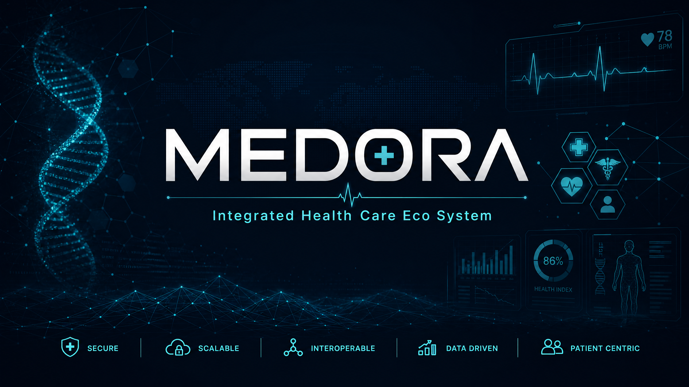
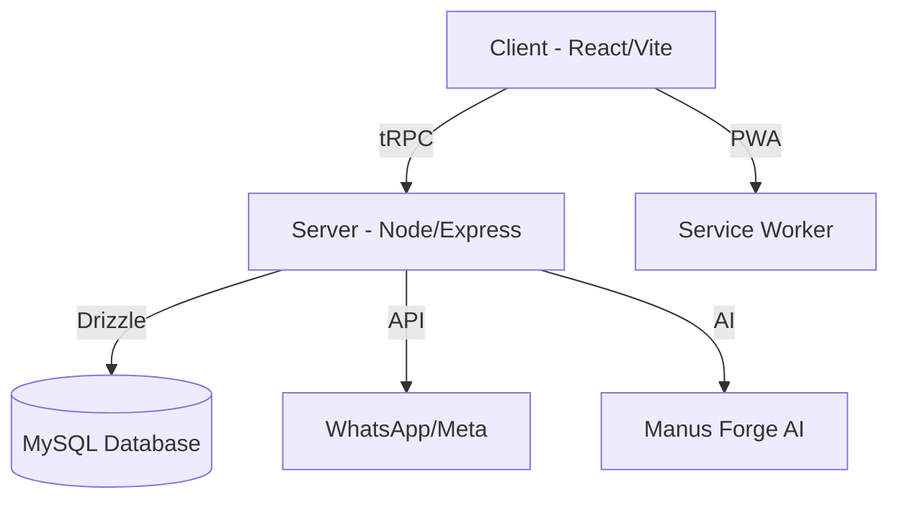

<div align="center">



# MEDORA | ميدورا
### Integrated Health Care Eco System | منظومة الرعاية الصحية المتكاملة

[](LICENSE)
[](.github/workflows/ci.yml)
[](package.json)
[](client/src/contexts/LocalizationContext.tsx)

[English](#english) | [العربية](#العربية)

</div>

---

## English

### 🌟 Overview
**MEDORA** is a next-generation, multi-country healthcare operations platform designed to bridge the gap between clinical excellence and operational efficiency. Built with a "Security-First" philosophy, MEDORA provides a unified ecosystem for pharmacies, hospitals, laboratories, and insurance providers.

### 🚀 Key Features
- **Integrated Operations:** Unified management for CRM, HR, Finance, and Customer Care.
- **Advanced Security:** Tamper-evident audit trails, encrypted storage, and heuristic privacy deterrents.
- **Bilingual & RTL:** Native support for Arabic and English with a seamless RTL (Right-to-Left) interface.
- **AI-Powered Insights:** Automated reporting and intelligent procurement flows.
- **Omnichannel Communication:** Integrated WhatsApp API and VoIP readiness for patient engagement.

### 🛠️ Tech Stack
- **Frontend:** React 19 + TypeScript + Vite + Tailwind CSS + Wouter.
- **Backend:** Node.js + Express + tRPC (Type-safe API).
- **Database:** Drizzle ORM + MySQL.
- **Testing:** Vitest + Playwright (E2E).
- **DevOps:** GitHub Actions (CI/CD) + Docker.

---

## العربية

### 🌟 نظرة عامة
**ميدورا (MEDORA)** هي منصة عمليات رعاية صحية متطورة ومتعددة الدول، مصممة لسد الفجوة بين التميز السريري والكفاءة التشغيلية. بُنيت ميدورا بفلسفة "الأمان أولاً"، وتوفر منظومة موحدة للصيدليات والمستشفيات والمختبرات ومزودي التأمين.

### 🚀 المميزات الرئيسية
- **عمليات متكاملة:** إدارة موحدة لعلاقات العملاء (CRM)، الموارد البشرية (HR)، المالية، وخدمة العملاء.
- **أمان متقدم:** سجلات تدقيق غير قابلة للتلاعب، تخزين مشفر، ووسائل ردع للخصوصية.
- **ثنائي اللغة وRTL:** دعم أصيل للغتين العربية والإنجليزية مع واجهة مستخدم متوافقة تماماً مع اتجاه الكتابة من اليمين إلى اليسار.
- **رؤى مدعومة بالذكاء الاصطناعي:** تقارير مؤتمتة وتدفقات شراء ذكية.
- **اتصال متعدد القنوات:** تكامل مع WhatsApp API وجاهزية VoIP للتفاعل مع المرضى.

### 🛠️ البنية التقنية
- **الواجهة الأمامية:** React 19 + TypeScript + Vite + Tailwind CSS.
- **الواجهة الخلفية:** Node.js + Express + tRPC.
- **قاعدة البيانات:** Drizzle ORM + MySQL.
- **الاختبارات:** Vitest + Playwright.
- **العمليات:** GitHub Actions + Docker.

---

## 🏗️ Architecture | المعمارية



## 📦 Installation | التثبيت

```bash
# Clone the repository | استنساخ المستودع
git clone https://github.com/MEDORA-Health-Care-Eco-System/MEDORA-Health-Care-Eco-System.git

# Install dependencies | تثبيت التبعيات
pnpm install

# Setup environment | إعداد البيئة
cp .env.example .env

# Start development | بدء التطوير
pnpm dev
```

---

<div align="center">

**🏥 MEDORA — Where Healthcare Meets Innovation**
**ميدورا — حيث تلتقي الرعاية الصحية بالابتكار**

*Created and Maintained by **Hossam Naeim Osman***
*تم الإنشاء والتطوير بواسطة **حسام نعيم عثمان***

</div>
