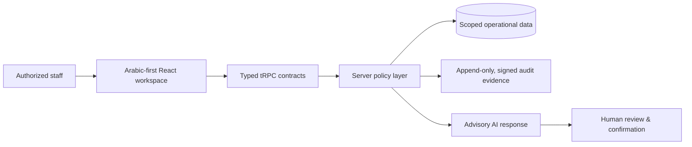

# MEDORA Health Care Eco System

<p align="center">
  <strong>Secure, multi-tenant operational infrastructure for healthcare organizations.</strong><br />
  <span lang="ar" dir="rtl">منظومة تشغيلية آمنة متعددة المستأجرين للجهات الصحية، صُممت بالعربية أولاً وبحوكمة قابلة للتدقيق.</span>
</p>

<p align="center">
  <a href="https://aldorapharm-fwilugbd.manus.space"></a>
  
  
  
</p>

> **MEDORA is not a generic CRUD dashboard.** It is a governed healthcare operating system that keeps people, branches, jurisdictions, clinical boundaries, and human decisions visible in the design of every workflow.

## The operating idea

Healthcare teams need speed at the counter, traceability in inventory, clarity in operations, and strict boundaries around sensitive decisions. MEDORA unifies those concerns in one Arabic-first, English-capable workspace. It is engineered for pharmacies, chains, distributors, hospitals, laboratories, insurers, rehabilitation centres, radiology providers, and public-health organizations.

| Principle | What it means in MEDORA |
| --- | --- |
| **One operational surface** | Role-aware access to ERP, POS, inventory, procurement, customer care, HR, finance foundations, and governance workflows. |
| **Scope is a security boundary** | Organization, branch, and jurisdiction are treated as first-class server-side constraints. Jurisdiction ID `0` is a valid legal scope. |
| **Human authority remains visible** | The AI assistant is advisory-only; sensitive actions require explicit human review and confirmation. |
| **Honest readiness** | External regulatory, payment, insurance, printer, and national-catalog integrations remain blocked until specifications, credentials, and acceptance evidence exist. |

## Capability map

The table distinguishes implemented product surfaces from integration-gated functions. A label or navigation item is never presented as external certification or live government connectivity.

| Domain | MEDORA capability | Control boundary |
| --- | --- | --- |
| **ERP & POS** | Scoped operational dashboard, POS preparation, fractional quantities, FEFO allocation planning, sales workflows, receipts and counter controls. | Server authorization, scope validation, regulated actions fail closed when prerequisites are absent. |
| **Inventory & traceability** | Batches, expiry, reorder signals, multi-branch foundations, Data Matrix / barcode-oriented workflows and traceability boundaries. | Product and regulatory evidence remain distinct; external traceability adapters need verified contracts. |
| **Procurement** | Supplier directory, purchase-review flows, SLA indicators, manager decision records, and approval reasoning. | Review reasons are required; no autonomous purchasing or transfers. |
| **CRM & care** | Customer-care profiles, consent-aware interaction foundations, call-centre tickets, callback and escalation structures. | Sensitive records remain role- and tenant-scoped. |
| **Finance & HR** | Role-gated financial foundations, expenses, payroll-rule foundations, people and shift workspaces. | Financial visibility is based on trusted organization membership roles, not UI-only checks. |
| **Compliance** | Country-pack foundations, authority-ready data boundaries, auditability, and explicit release gates. | No legal or regulatory certification is claimed without current authority evidence. |
| **AI & support** | Floating bilingual assistant, contextual smart typing, support tickets, human-review messaging and safe fallback behavior. | Advisory only; no autonomous clinical, financial, purchase, permission, or regulated action. |

## Architecture at a glance



### Guardrails that are designed in—not bolted on

| Boundary | Implementation approach |
| --- | --- |
| **Tenant isolation** | Regulated reads and mutations validate organization, branch, jurisdiction, and authorized membership on the server. |
| **Clinical safety** | Prescription and patient-related paths are fail-closed. AI output does not diagnose, dispense, or silently create clinical work. |
| **Decision governance** | Procurement and transfer review records capture a mandatory human reason and tamper-evident audit evidence. |
| **Content protection** | Authenticated web workspaces deter common copy/print/capture pathways and record minimized, scoped risk signals without storing clipboard contents, user text, or device fingerprints. |
| **Source integrity** | Proprietary licensing notices, a SHA-256 integrity manifest, and release-evidence guidance protect the project’s authorship and deployment review process. |
| **Native-device boundary** | Android, iOS, and HarmonyOS wrapper references are documented as release-gated work; browser code is never claimed to prevent OS-level or physical capture absolutely. |

## Experience design

MEDORA deliberately reduces the first screen to the next authorized operational step. Secondary detail is progressively disclosed, navigation adapts to role and scope, and the system works in Arabic RTL and English LTR layouts.

The **MEDORA AI Assistant** is a floating, context-aware workspace available on every authorized screen. It opens as a responsive side panel, pre-fills an editable question about the current workflow, supports keyboard and touch use, and keeps its human-review limitation visible. Opening the assistant never sends data or executes a change on the user’s behalf.

## Technology

| Layer | Selected technology |
| --- | --- |
| Client | React 19, TypeScript, Tailwind CSS 4, Radix-based UI primitives |
| Application contracts | tRPC v11 with typed React hooks |
| Server | Express 4, TypeScript, server-side authorization policies |
| Data | Drizzle ORM with MySQL/TiDB-compatible schema and non-destructive migrations |
| Quality | Vitest regression contracts, strict TypeScript checks, production build verification |
| Delivery | Managed deployment with automatic checkpoint publication |

## Local development

### Prerequisites

- Node.js 22+
- pnpm 9+
- A provisioned database and the platform-managed environment variables for authentication, session signing, and storage

### Run the workspace

```bash
git clone https://github.com/0SSAM/MEDORA-Health-Care-Eco-System.git
cd MEDORA-Health-Care-Eco-System
pnpm install
pnpm dev
```

The application uses environment-managed credentials. **Do not commit `.env` files, passwords, API keys, patient records, or production exports.** Schema evolution follows a non-destructive process: update the Drizzle schema, generate a migration, review it, and apply it only through the approved database path.

### Verify before release

```bash
pnpm check
pnpm test
pnpm exec playwright install --with-deps chromium
pnpm e2e
pnpm build
```

Every release should additionally validate role denial, organization/branch/jurisdiction isolation, Arabic RTL and English LTR layouts, core POS visibility, and the safe degraded state of integration-gated workflows.

The public E2E suite is intentionally non-destructive: it verifies the MEDORA landing surface, Arabic RTL and English LTR switching, and language persistence without login, patient records, regulated mutations, or external provider calls. قبل تشغيل الاختبارات محلياً، ثبّت Chromium بالأمر الموضح أعلاه؛ وتتحقق المجموعة العامة فقط من واجهة MEDORA واتجاه العربية والإنجليزية وحفظ اللغة من دون تسجيل دخول أو بيانات مرضى أو عمليات منظّمة أو استدعاءات لمزوّدين خارجيين.

## Deployment and integration posture

The managed deployment is available at [MEDORA Live Demo](https://aldorapharm-fwilugbd.manus.space). The demo is an application surface—not evidence of regulatory approval or third-party integration activation.

| Area | Current posture |
| --- | --- |
| Regulatory / government submission | Contract and readiness boundaries only until official specifications, credentials, effective dates, and acceptance evidence are present. |
| Insurance, payment and device providers | Explicitly integration-gated; no simulated production acknowledgement is presented. |
| Notifications and automation | Internally scoped, auditable flows; no external webhook execution authority is enabled in the operational path. |
| Native screen protection | Reference implementations and release gate documented; activation requires signed wrapper integration and real-device acceptance evidence. |

## Repository guide

```text
client/                 React workspace, role-aware UI, RTL/LTR experience
server/                 Typed routers, policy enforcement, integration boundaries
drizzle/                Schema and reviewed migrations
docs/security/          Source integrity, protection evidence, native release gates
native-wrapper-reference/  Android, iOS and HarmonyOS reference controls
server/*.test.ts        Regression and policy contracts
```

## Responsible use and contribution

Contributions should be small, testable, and scope-aware. Do not add mock clinical records, fake regulatory replies, real credentials, unscoped queries, external execution paths, or auto-executing AI behavior. Add a regression contract for every authorization, isolation, or clinical-boundary change.

MEDORA is proprietary software. See [`LICENSE`](./LICENSE) and [`NOTICE`](./NOTICE) for copyright and permitted-use terms.

---

<p align="center"><strong>MEDORA Health Care Eco System</strong><br /><span lang="ar" dir="rtl">تشغيل صحي مسؤول، قابل للتدقيق، ومصمم لقرار إنساني واعٍ.</span></p>
