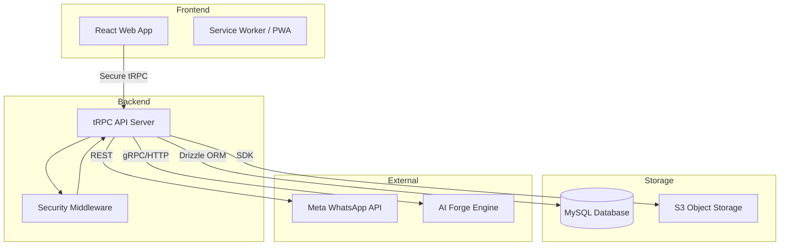

<div align="center">


# MEDORA | ميدورا
### The Future of Integrated Healthcare Operations
### مستقبل عمليات الرعاية الصحية المتكاملة

[](LICENSE)
[](.github/workflows/ci.yml)
[](package.json)
[](client/src/contexts/LocalizationContext.tsx)

[English](#english) | [العربية](#العربية)

</div>

---

## English

### 🌟 Vision
**MEDORA** is a sophisticated, multi-tenant ecosystem designed for modern healthcare institutions. It synchronizes clinical workflows with robust operational management, ensuring that healthcare providers can focus on patient care while the system handles the complexities of administration, finance, and compliance.

### 🚀 Core Pillars
| Pillar | Description |
| :--- | :--- |
| **Integrated Ops** | Unified control for CRM, HR, and multi-currency Finance. |
| **Security First** | Biometric Auth (WebAuthn), GPS geofencing, and audit trails. |
| **Bilingual Excellence** | Native Arabic/English support with perfect RTL layout. |
| **Inventory Ops** | Multi-branch transfers and FEFO-compliant adjustments. |
| **Connectivity** | Native WhatsApp API integration and VoIP readiness. |

### 🛠️ Technology Stack
- **Frontend:** React 19, TypeScript, Vite, Tailwind CSS.
- **Backend:** Node.js, Express, tRPC (Type-safe communication).
- **Persistence:** Drizzle ORM, MySQL (High-availability configuration).
- **Quality Assurance:** Vitest (Unit), Playwright (E2E).

---

## العربية

### 🌟 الرؤية
**ميدورا (MEDORA)** هي منظومة متطورة متعددة المستأجرين مصممة للمؤسسات الصحية الحديثة. تقوم المنصة بمزامنة سير العمل السريري مع الإدارة التشغيلية القوية، مما يضمن تركيز مقدمي الرعاية على المريض بينما يتولى النظام تعقيدات الإدارة والمالية والامتثال.

### 🚀 الركائز الأساسية
| الركيزة | الوصف |
| :--- | :--- |
| **عمليات متكاملة** | تحكم موحد في علاقات العملاء، الموارد البشرية، والمالية متعددة العملات. |
| **الأمان أولاً** | بصمة الإصبع/الوجه (WebAuthn)، تحديد الموقع (GPS)، وسجلات تدقيق. |
| **تميز ثنائي اللغة** | دعم أصيل للعربية والإنجليزية مع توافق تام لاتجاه RTL. |
| **إدارة المخزون** | تحويلات بين الفروع وتسويات متوافقة مع سياسة FEFO. |
| **اتصال متطور** | تكامل أصيل مع WhatsApp API وجاهزية تامة لأنظمة VoIP. |

### 🛠️ البنية التقنية
- **الواجهة الأمامية:** React 19, TypeScript, Vite, Tailwind CSS.
- **الواجهة الخلفية:** Node.js, Express, tRPC.
- **قاعدة البيانات:** Drizzle ORM, MySQL.
- **ضمان الجودة:** Vitest, Playwright.

---

## 🏗️ System Architecture | معمارية النظام



## 📦 Getting Started | البدء السريع

```bash
# Clone the masterpiece | استنساخ التحفة البرمجية
git clone https://github.com/MEDORA-Health-Care-Eco-System/MEDORA-Health-Care-Eco-System.git

# Install dependencies | تثبيت التبعيات
pnpm install

# Initialize Environment | تهيئة البيئة
cp .env.example .env

# Launch Development | إطلاق بيئة التطوير
pnpm dev
```

---

<div align="center">

**🏥 MEDORA — Where Healthcare Meets Innovation**
**ميدورا — حيث تلتقي الرعاية الصحية بالابتكار**

*Designed and Engineered by **Hossam Naeim Osman***
*تم التصميم والهندسة بواسطة **حسام نعيم عثمان***

</div>
