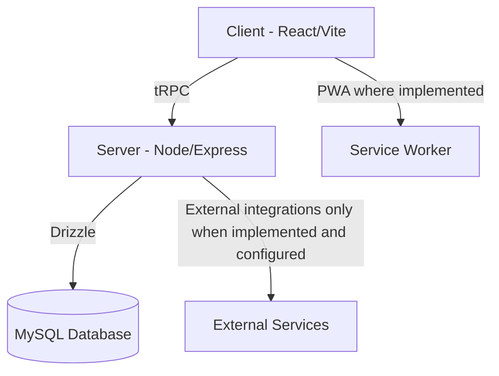

<div align="center">


# MEDORA | ميدورا
### Integrated Health Care Eco System | منظومة الرعاية الصحية المتكاملة

[](LICENSE)
[](.github/workflows/ci.yml)
[](package.json)
[](client/src/contexts/LocalizationContext.tsx)

**Canonical repository:** `0SSAM/MEDORA-Health-Care-Eco-System`

[English](#english) | [العربية](#العربية)

</div>

---

## English

### Overview
MEDORA is a healthcare operations platform organized around a unified application architecture. This repository is the canonical engineering source of truth for the project.

### Current verified engineering capabilities
- React + TypeScript frontend with Arabic/English localization and RTL/LTR direction handling.
- Node.js + Express + tRPC backend.
- Drizzle ORM with MySQL.
- Automated TypeScript, unit/contract, build and isolated database lifecycle checks through GitHub Actions.
- CodeQL security analysis configured in the repository's GitHub security workflow.

### Capability-status rule
Marketing, investor, RFP, or product material must distinguish between implemented functionality, partial functionality, planned integrations, and claims requiring external validation. References to regulated clinical, financial, insurance, government, WhatsApp, VoIP, AI, or production capabilities must not be treated as proof of operational readiness unless the corresponding implementation and validation evidence exists.

### Tech Stack
- **Frontend:** React + TypeScript + Vite + Tailwind CSS.
- **Backend:** Node.js + Express + tRPC.
- **Database:** Drizzle ORM + MySQL.
- **Testing:** Vitest + Playwright.
- **DevOps/Security:** GitHub Actions + Docker + CodeQL.

---

## العربية

### نظرة عامة
ميدورا هي منصة لعمليات الرعاية الصحية مبنية حول معمارية تطبيق موحدة. هذا المستودع هو **المصدر الهندسي المرجعي الرسمي** للمشروع.

### القدرات الهندسية المتحققة حاليًا
- واجهة React وTypeScript مع دعم العربية والإنجليزية واتجاهي RTL/LTR.
- خادم Node.js وExpress وtRPC.
- Drizzle ORM مع MySQL.
- اختبارات آلية للـTypeScript والوحدات والعقود والبناء ودورة حياة قاعدة بيانات معزولة عبر GitHub Actions.
- تفعيل تحليل CodeQL الأمني ضمن منظومة أمان GitHub الخاصة بالمستودع.

### قاعدة إثبات القدرات
يجب أن تميز المواد التسويقية أو الاستثمارية أو عروض RFP بين الوظائف المنفذة فعليًا، والوظائف الجزئية، والتكاملات المخطط لها، والادعاءات التي تحتاج إلى تحقق خارجي. ولا يجوز اعتبار الإشارات إلى الوظائف السريرية أو المالية أو التأمينية أو الحكومية المنظمة، أو WhatsApp أو VoIP أو الذكاء الاصطناعي أو الجاهزية الإنتاجية، دليلًا على الجاهزية التشغيلية ما لم توجد أدلة تنفيذ واختبار مناسبة.

### البنية التقنية
- **الواجهة:** React + TypeScript + Vite + Tailwind CSS.
- **الخادم:** Node.js + Express + tRPC.
- **قاعدة البيانات:** Drizzle ORM + MySQL.
- **الاختبارات:** Vitest + Playwright.
- **DevOps والأمان:** GitHub Actions + Docker + CodeQL.

---

## Architecture



## Installation

```bash
git clone https://github.com/0SSAM/MEDORA-Health-Care-Eco-System.git
cd MEDORA-Health-Care-Eco-System
pnpm install
cp .env.example .env
pnpm check
pnpm test
pnpm build
pnpm dev
```

---

<div align="center">

**MEDORA — Where Healthcare Meets Innovation**
**ميدورا — حيث تلتقي الرعاية الصحية بالابتكار**

*Canonical repository: 0SSAM/MEDORA-Health-Care-Eco-System*

</div>
