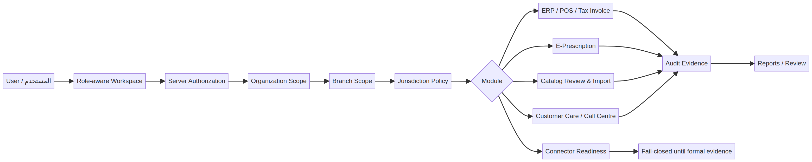
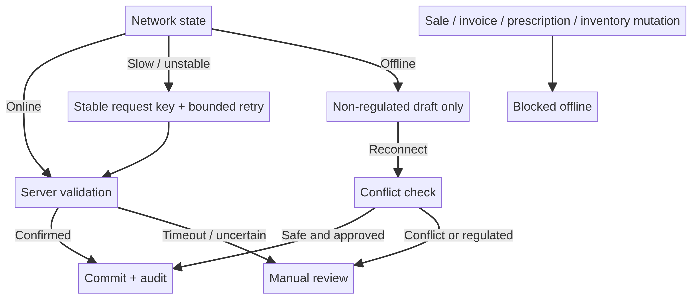

# MEDORA | منظومة الرعاية الصحية المتكاملة

## وثيقة تعريف المنتج والهوية — Product Description and Identity Brief

**الإصدار:** 2026-08-15  
**اللغة:** العربية والإنجليزية  
**المالك المنتجِي:** Hossam Naeim Osman، مع حفظ الخصوصية وعدم نشر بيانات الاتصال الشخصية  
**حالة الوثيقة:** وصف هندسي وتجاري؛ لا يمثل اعتماداً حكومياً أو شهادة امتثال قانونية.

## الملخص التنفيذي | Executive summary

**العربية.** MEDORA هي منظومة تشغيل صحية معيارية تركز على الصيدليات والفروع والعمليات الصحية المتصلة بها. صُممت لتجمع التشغيل اليومي، نقاط البيع، المخزون، الكتالوج ذي المصدر، الوصفة الإلكترونية، خدمة العملاء، مركز الاتصال، الفواتير المحلية، التنبيهات، سجلات التدقيق، والجاهزية للتكاملات الرسمية في مساحة واحدة. جوهرها هو أن كل عملية منظمة يجب أن تكون مرتبطة بالمؤسسة والفرع والاختصاص، وأن تتوقف بأمان عند غياب الاعتماد أو الدليل المطلوب.

**English.** MEDORA is a modular healthcare operations platform focused on pharmacies, branches, and adjacent healthcare workflows. It brings together daily operations, POS, inventory, provenance-aware catalog review, e-prescription, customer care, call-centre foundations, local tax invoicing, notifications, audit evidence, and readiness boundaries for official integrations. Its core principle is that regulated actions are organization-, branch-, and jurisdiction-scoped and fail closed when required evidence or authorization is missing.

## هوية MEDORA | MEDORA identity

**MEDORA** هو اسم الهوية التجارية للمنصة، ويُستخدم في الواجهة والوثائق والعروض باعتباره علامة لمنظومة تشغيل صحي متكاملة. لا يُقدَّم الاسم على أنه اختصار قانوني أو اسم جهة حكومية أو شهادة اعتماد.

> **MEDORA | Integrated Health System**
> **ميدورا | منظومة الرعاية الصحية المتكاملة**

الرسالة التجارية للهوية هي تقديم تشغيل صحي متاح، محلي، ويمكن الاعتماد عليه، مع الحفاظ على حدود واضحة بين ما هو منفذ داخل المنتج وما يتطلب اعتماداً أو تكاملاً خارجياً.

## القيمة الأساسية | Core value

| القيمة | بالعربية | English |
|---|---|---|
| Scope safety | عزل المؤسسة والفرع والاختصاص على الخادم | Server-enforced organization, branch, and jurisdiction isolation |
| Operational clarity | شاشات عملية وحالات واضحة ومؤشرات قابلة للفهم | Practical screens, clear states, and understandable indicators |
| Regulatory honesty | التكامل الرسمي مغلق حتى توافر المواصفات والاعتمادات | Official connectors remain blocked until specifications and credentials exist |
| Traceability | مصدر للصنف، سجل تدقيق، وربط للعمليات الحساسة | Catalog provenance, audit evidence, and traceable sensitive operations |
| Local readiness | حزم قواعد يمكن تخصيصها لكل دولة | Versioned country packs rather than one unsafe global assumption |
| Resilience | واجهة تعمل مع اتصال ضعيف ضمن حدود آمنة | Weak-connection resilience within safe, non-regulated boundaries |

## المكونات الحالية | Current components

**العربية.** تشمل النواة الحالية ERP/POS للصيدليات والفروع، المنتجات والدفعات وFEFO، المبيعات والمرتجعات والفواتير الضريبية المحلية، مراجعة واستيراد الكتالوج، الوصفة الإلكترونية، خدمة العملاء ومركز الاتصال، الإشعارات، لوحة جاهزية الموصلات، البحث المرجعي ICD-10-CM، إعدادات الأمان، الاختصارات، ومخرجات PDF المحلية. توجد كذلك أسس تأمينية وتقارير مجدولة، لكنها لا تعني وجود اتصال حي بشركة تأمين أو جهة حكومية.

**English.** The current core includes pharmacy/branch ERP and POS, products and batches with FEFO planning, sales/returns/local tax invoices, catalog review/import, e-prescription, customer care and call-centre foundations, notifications, connector-readiness dashboards, ICD-10-CM reference search, security settings, shortcuts, and local PDF outputs. Insurance and scheduled-report foundations exist, but they do not represent live payer or government connectivity.

## بصرياً | At a glance

## رحلة العملية | Operating journey

1. يحدد المستخدم المؤسسة والفرع والاختصاص. / The user operates within an organization, branch, and jurisdiction.
2. يختار الوحدة من مساحة العمل أو الاختصار المناسب. / The user opens a module through the workspace or role-relevant shortcut.
3. يتحقق الخادم من الصلاحية والنطاق وحالة القواعد. / The server checks authorization, scope, and policy readiness.
4. تُحفظ العملية الحساسة مع رقم تتبع وتدقيق. / Sensitive operations receive traceable identifiers and audit evidence.
5. عند غياب الاتصال أو الاعتماد، تتحول العملية إلى حالة مسودة أو حظر واضح، لا إلى نجاح وهمي. / When connectivity or evidence is missing, the operation becomes an explicit draft or blocked state—not a false success.

## أهمية المنصة | Why it matters

تحتاج المؤسسات الصحية إلى التوفيق بين سرعة التشغيل، دقة المخزون، حماية البيانات، وتنوع المتطلبات المحلية. تقدم MEDORA إطاراً تدريجياً يسمح بإضافة بلد أو جهة أو موصل بعد التحقق من مصدره، بدلاً من تفعيل تكامل غير موثق قد يعرّض المؤسسة للمخاطر. هذا يجعل المنصة مناسبة للعرض على الصيدليات، السلاسل، الموزعين، المستشفيات، معامل التحاليل، مراكز التأهيل، وشركات التأمين باعتبارها منصة قابلة للتوسع، مع تحديد واضح لما هو جاهز وما يحتاج إلى اعتماد خارجي.

## نموذج الأمان | Security model

تستخدم المنصة إدارة أسرار خارج المستودع، تشفيراً موثقاً للبيانات الحساسة، حدوداً خادمية للمؤسسة والفرع والاختصاص، سجلات تدقيق مقاومة للتلاعب، ومبدأ الفشل الآمن للتكاملات الرسمية. لا ينبغي وصف سلسلة الهاش بأنها Blockchain؛ هي **tamper-evident audit chain** ما لم تُبنَ شبكة دفتر أستاذ مرخصة بمتطلبات حوكمة واضحة.

## المرونة الآمنة | Safe resilience

## حدود صريحة | Explicit boundaries

| لا ينبغي ادعاؤه | الصياغة الصحيحة |
|---|---|
| اعتماد حكومي أو اتصال ETA/EDA/UHIA حي | جاهزية تكامل محكومة وبوابة مغلقة حتى توفر الاعتماد |
| تشغيل مالي كامل دون خادم أو شبكة | مسودات غير منظمة فقط عند انقطاع الشبكة |
| دعم مضمون لكل جهاز قديم | دعم قابل للتحقق ضمن متصفحات وأجهزة معتمدة واختبارات أداء |
| امتلاك قانوني يثبته الكود وحده | بصمة منشأ تقنية تحتاج إلى تسجيلات واتفاقيات قانونية |
| تكافؤ كامل مع SAP/Oracle/Dynamics/Odoo | نواة صحية معيارية مع مجالات توسعة محددة |

## خاتمة | Closing statement

MEDORA ليست مجرد شاشة بيع أو قاعدة بيانات أصناف؛ إنها اتجاه هندسي لبناء تشغيل صحي محلي، قابل للتدقيق، متعدد المؤسسات، وقابل للتوسع. قوتها الأساسية في الصراحة والحدود الأمنية: ما تم تنفيذه يمكن اختباره، وما يحتاج جهة خارجية يظل مغلقاً حتى تتوافر الأدلة.

**MEDORA | Accessible, Localized, Dependable Operations for healthcare.**

## References

1. [MEDORA comprehensive platform audit](comprehensive-platform-audit-2026-08-15.md)
2. [MEDORA capability gap report](capability-gap-report.md)
3. [MEDORA ownership notes](ownership-notes.md)
4. [MEDORA operations guide](operations.md)
